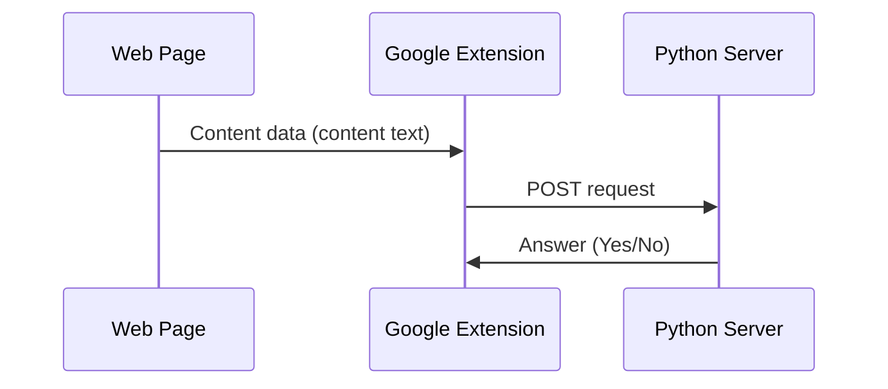

# Suicide Scanner
A simple project that will save the world a little :)

# Files
Now there are two folders
-  	**addon** > Google Extension

- **python** > **server** > Python Server
	> There are some other files in **python** folder. These are simple scripts for working with datasets.

## How it works?

